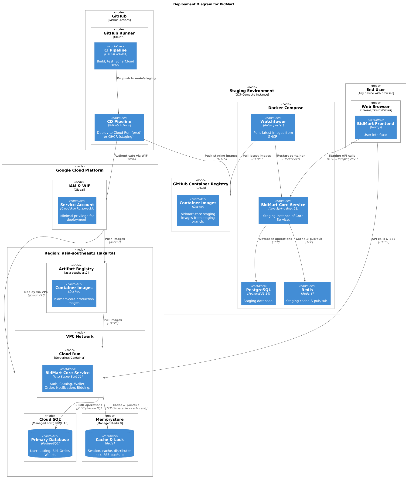
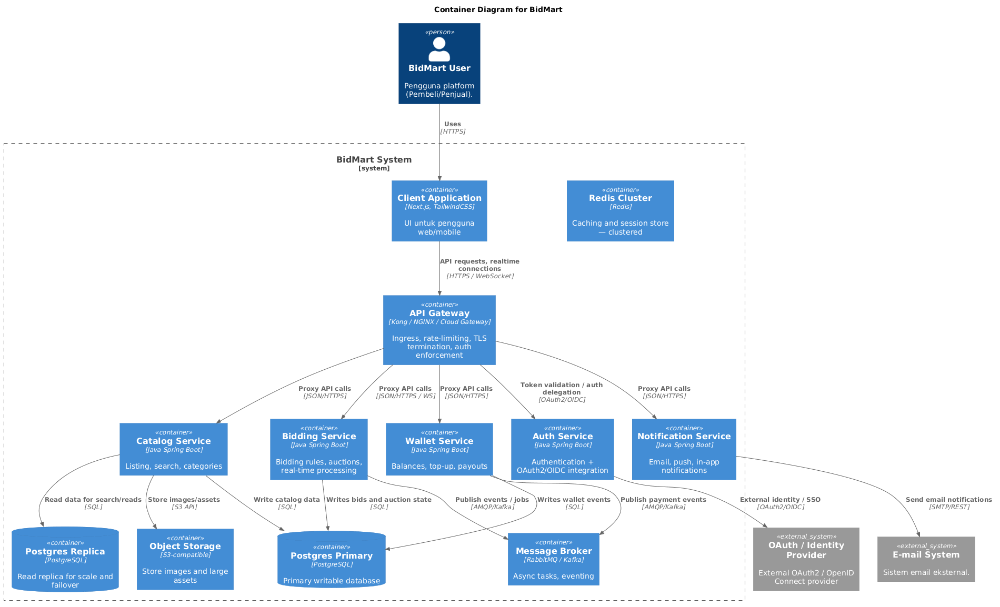
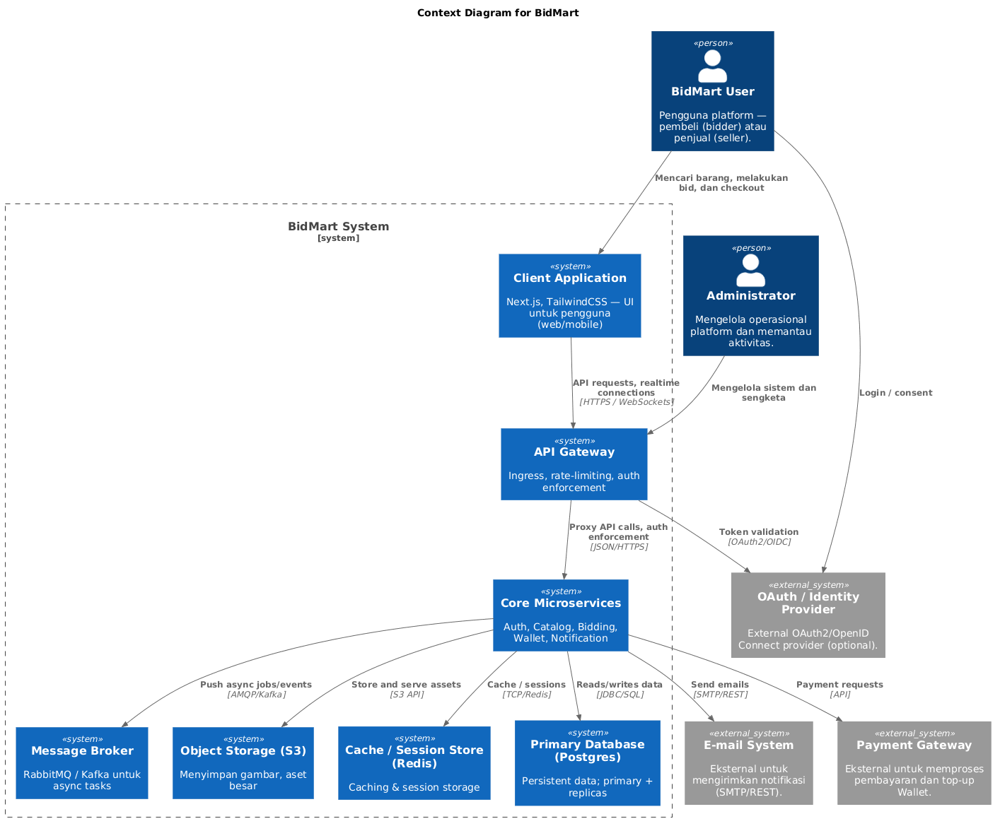
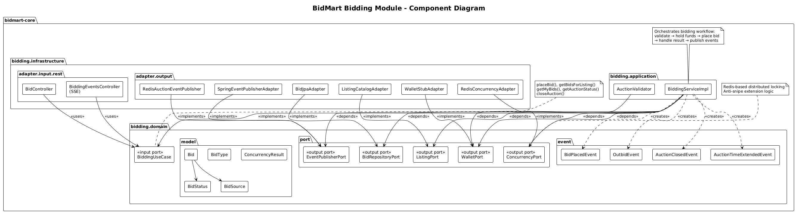
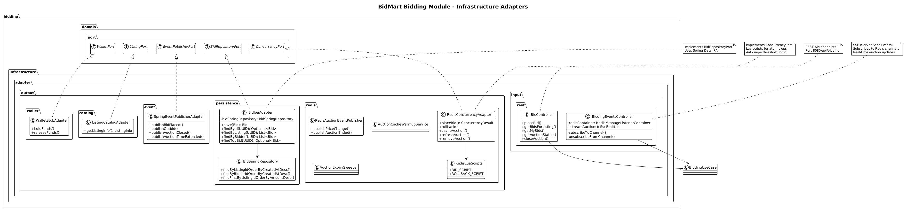
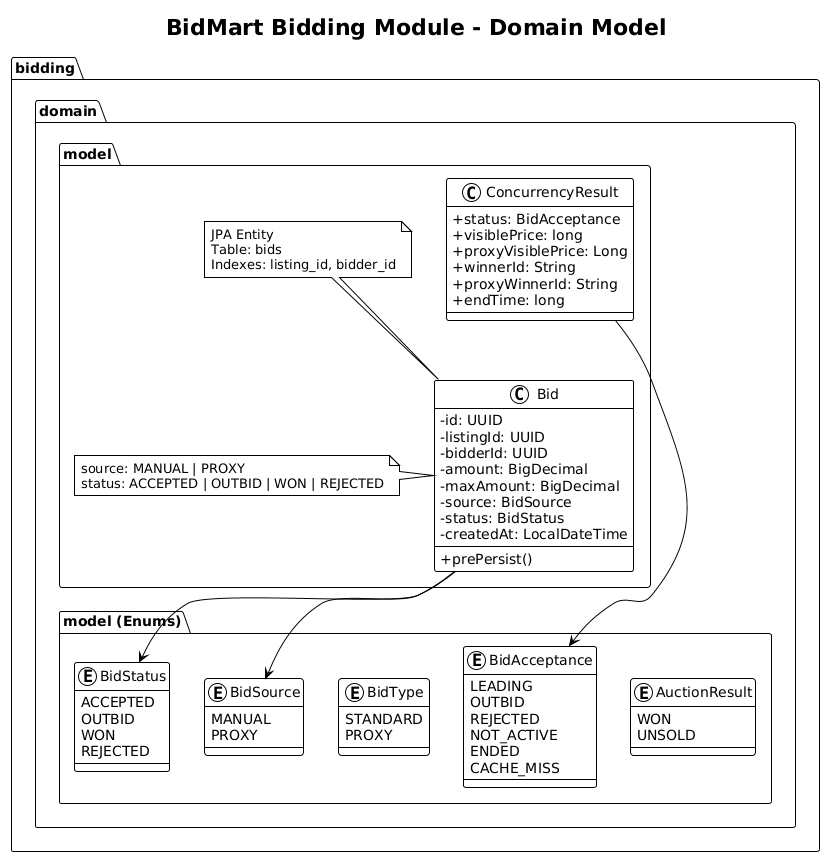
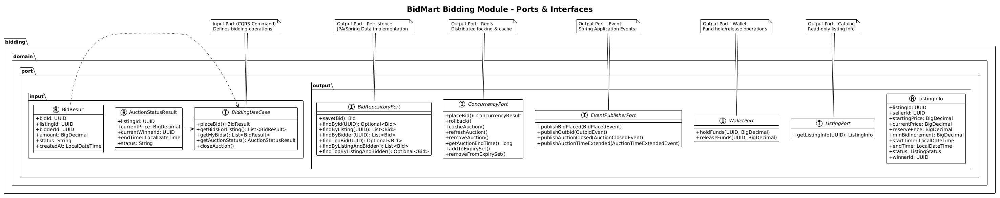
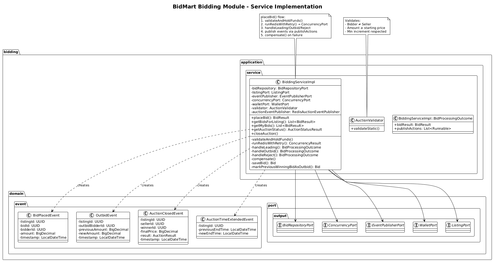

## B13 - Bidmart

## Deliverable G.1

### Context Diagram

### Container Diagram

### Deployment Diagram

## Deliverable G.2

### Container Diagram (Future Plans)

### Context Diagram (Future Plans)

## Deliverable G.3

### Risk Analysis

Arsitektur saat ini masih bergantung pada satu Java Spring Boot core dan satu database PostgreSQL utama. Kondisi ini menimbulkan beberapa risiko karena seluruh fitur berada dalam satu sistem besar. Jika terjadi gangguan, bug, atau lonjakan traffic pada satu fitur seperti bidding, fitur lain seperti autentikasi atau wallet juga bisa ikut terdampak. Selain itu, penggunaan satu database utama juga menjadi titik kelemahan karena ketika database bermasalah, seluruh sistem dapat terganggu. Belum adanya replika database atau mekanisme failover yang matang membuat risiko downtime menjadi lebih besar.

Dari sisi operasional dan keamanan, sistem juga masih memiliki keterbatasan. Penyimpanan aset besar seperti media belum menggunakan object storage khusus, sehingga dapat memperlambat proses backup dan recovery. Cache dan session store yang masih single-instance juga kurang optimal saat terjadi lonjakan pengguna. Selain itu, belum adanya API Gateway dan integrasi OAuth2/OpenID Connect membuat pengelolaan keamanan seperti MFA, rate limiting, dan validasi token menjadi lebih sulit dilakukan secara terpusat. Untuk mengatasi hal tersebut, arsitektur baru menambahkan API Gateway, memisahkan core menjadi beberapa service, menggunakan message broker untuk proses asynchronous, serta menambahkan object storage, replika database, dan Redis cluster.

### Justifikasi Arsitektur

Arsitektur yang direkomendasikan menggunakan API Gateway dan beberapa microservices dengan tugas yang lebih spesifik, seperti Auth, Catalog, Bidding, Wallet, dan Notification. Dengan cara ini, setiap service dapat dikembangkan dan di-scale secara terpisah sehingga sistem menjadi lebih fleksibel dan tidak mudah terdampak secara keseluruhan ketika satu service mengalami masalah. API Gateway juga membantu memusatkan pengelolaan keamanan seperti autentikasi, TLS, dan rate limiting agar setiap service dapat fokus pada logika bisnis masing-masing.

Selain itu, penggunaan message broker seperti RabbitMQ atau Kafka memungkinkan proses berat dijalankan secara asynchronous sehingga aplikasi tetap responsif saat menerima banyak request. Penyimpanan media dipindahkan ke object storage yang kompatibel dengan S3 agar database tidak terbebani file berukuran besar. Penambahan replika PostgreSQL dan Redis cluster juga membantu meningkatkan performa dan ketahanan sistem. Service Rust yang saat ini belum digunakan juga dapat dimanfaatkan di masa depan untuk proses bidding yang membutuhkan performa tinggi dan latensi rendah.

## Kevin Cornellius Widjaja [2406428781] - Bidding Module

### Component Diagram

### Code Diagrams
- Adapters \

- Domain \

- Ports \

- Service \
